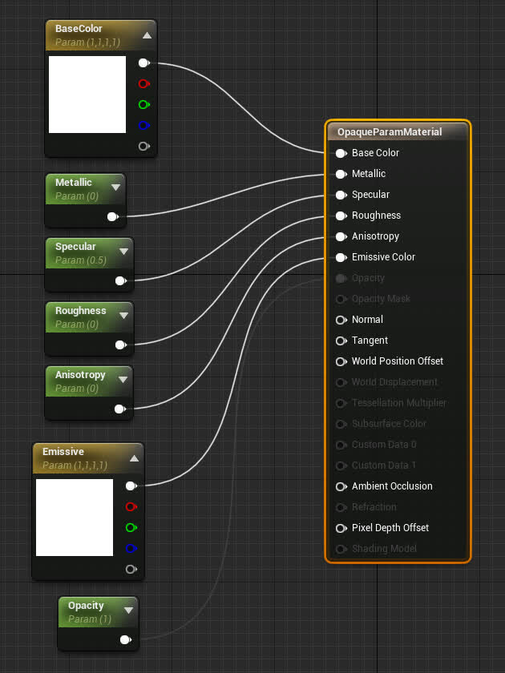
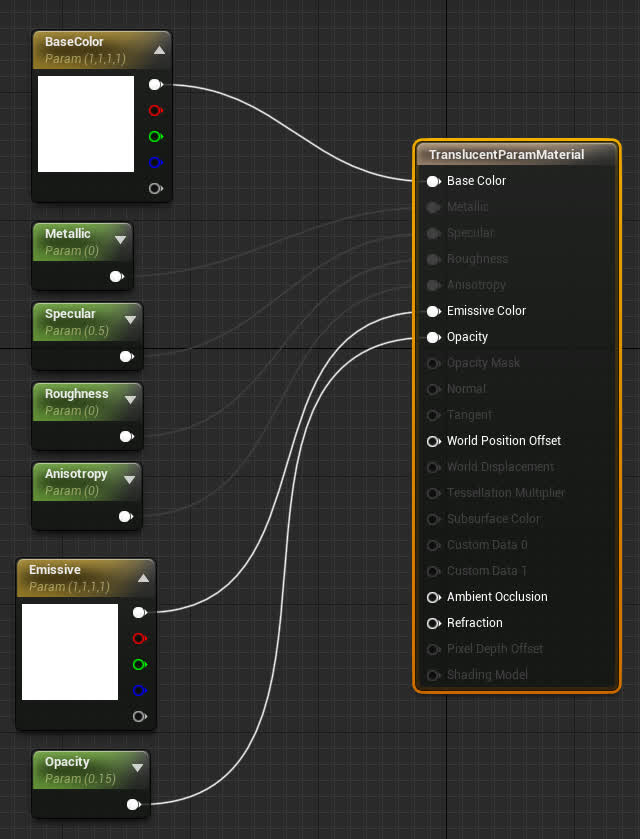

# DReyeVR custom actors

## What?
We are often interested in spawning arbitrary "AR-like" (Augmented reality) elements in the simulator at runtime that can be completely recorded and reenacted without hassle. 

### Example: 3D Bounding Boxes
- With a translucent (Opacity < 1) material we can simply create an elongated Cube actor and overlay it over any extent as a simple BBOX indicator.
    - We can have the actor track the extent, so it can follow a vehicle/pedestrian/anything and not interfere with physics at all (physics simulation is disabled).
    - Psst! this is actually already mostly implemented (but disabled) in the code, check out the [example at the bottom](CustomActor.md#bounding-box-example)

### Example: Gaze lines
- If you want to draw the eye gaze rays in realtime (without using `DrawDebugLine`, which is editor-only), you can simply use an elongated cube as a "ray" from the user gaze origin to the world-space gaze target.

### Example: Debug trails
- Similar to the debug path in Carla, spawning a trail of dynamic spheres can be useful to draw AR-like guidelines in the world and help direct drivers through the map.

## Why?
1. Having each "CustomActor" be its own entity (not necessarily tied to the EgoVehicle/EgoSensor) allows it to be recorded with the CARLA recorder easily and without modifying the core DReyeVR data. This is important when we want to change the API of the recorder (which happens quite often) but don't want to lose data from previous experiments that have data recordings (in binary format) that we can't modify easily.
2. Abstracting the "CustomActor"s gives us plenty of flexibility for manipulating the actors in the simulator at runtime and allows for new interesting scenarios to be performed easily without worry of recording/replay.


# Usage

Using these CustomActors is designed to be straightforward and cooperate with UE4/Carla's notion of [AActors](https://docs.unrealengine.com/5.0/en-US/API/Runtime/Engine/GameFramework/AActor/). You can see how we define all the core data for these actors (and what gets recorded/replayed) in [`DReyeVRData.h`](../Carla/Sensor/DReyeVRData.h)`::CustomActorData`

We have several basic 3D shapes ready for simple CustomActor usage. Theoretically you can use any static mesh. To access these types (or add your own) you should check out the references in [`DReyeVRCustomActor.h`](../Carla/Actor/DReyeVRCustomActor.h):
```c++
#define MAT_OPAQUE "Material'/Game/DReyeVR/Custom/OpaqueParamMaterial.OpaqueParamMaterial'"
#define MAT_TRANSLUCENT "Material'/Game/DReyeVR/Custom/TranslucentParamMaterial.TranslucentParamMaterial'"
#define SM_SPHERE "StaticMesh'/Engine/BasicShapes/Sphere.Sphere'"
#define SM_CUBE "StaticMesh'/Engine/BasicShapes/Cube.Cube'"
#define SM_CONE "StaticMesh'/Engine/BasicShapes/Cone.Cone'"

// add a new string literal here
#define SM_CUSTOM_MESH "StaticMesh'/Path/To/Your/StaticMesh.StaticMesh'"
```

## Spawn a custom actor

```c++
#include "Carla/Actor/DReyeVRCustomActor.h"
...
// example parameters, you can change these to whavever you'd like
FString PathToSM = SM_CUBE;
FString PathToMat = MAT_TRANSLUCENT;
FString Name = "NewActorName"; // every actor needs a unique name!
UWorld *World = GetWorld();
ADReyeVRCustomActor *A = ADReyeVRCustomActor::CreateNew(PathToSM, PathToMaterial, World, Name);
```

Implementation wise, the custom actors are all managed by a "global" table (`static std::unordered_map<std::string, class ADReyeVRCustomActor *>`) that indexes the actors by their `Name` therefore it is critical that they all have unique names. This is often easy to do when spawning many since UE4 `AActor`s themselves have unique names enumerated by their spawn order. To further understand how we use the global table, check out `ADReyeVRCustomActor::ActiveCustomActors` in [`DReyevRCustomActor.h`](../Carla/Actor/DReyeVRCustomActor.h)

## Activate/deactivate a custom actor

To activate (see in the world) simply run
```c++
A->Activate();
```
This will ensure every tick of this actor will be recorded with the Carla recorder. 

Similarly, to deactivate the actor (disable visibility, recording, and tick function) do:
```c++
A->Deactivate();
```

You can check whether or not an actor is "active" with `A->IsActive()`. While true (the actor is active) the actor will automatically be recorded in the CARLA recorder which will allow replaying without hassle. 

## Update a custom actor
These methods come from the UE4 `AActor` base class, which our class inherits from and extends. 
```c++
// resize the actor
A->SetActorScale3D(FVector(1, 1, 0.5));

// move the actor
A->SetActorLocation(FVector(100, 200, 0));

// rotate the actor
A->SetActorRotation(FRotator(90, 45, 0));
```

Assuming you are using one of the param-materials we provide for you, you can also modify the material parameters and have them take effect in realtime:
```c++
// change vector properties
A->MaterialParams.BaseColor = FLinearColor(1, 0, 0, 1); // RGBA
A->MaterialParams.Emissive = 100.f * FLinearColor(1, 0, 0, 1); // RGBA

// change scalar properties
A->MaterialParams.Metallic = 0.f;
A->MaterialParams.Specular += 0.15f;
A->MaterialParams.Roughness = 1.f;
A->MaterialParams.Anisotropy = 0.5f;
```

Note that in order to use the `Opacity` property, the material needs to have a translucent blend mode. So far we only have two material types, opaque and translucent, each with their own set of available properties as follows:
| OpaqueParamMaterial | TranslucentParamMaterial |
| --- | --- |
|  |  |

## Bounding Box Example

As an example of the CustomActor bounding boxes in action, checkout [`LevelScript.cpp::DrawBBoxes`](../DReyeVR/LevelScript.cpp) where some simple logic for drawing translucent bounding boxes is held (coloured based on distance to EgoVehicle). To enable this function, you'll need to manually enable it by removing the `#if 0` and corresponding `#endif` around the function body.

Here is what it might look like in action:

